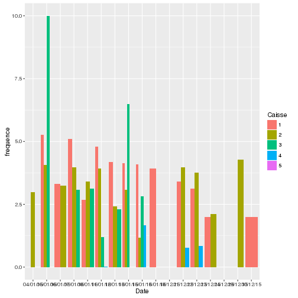
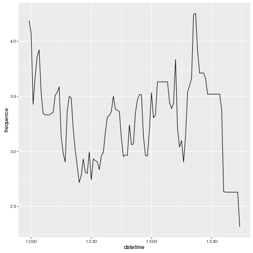

## Les données de la cantine

Variables
- Date
- Heure
- Numéro du ticket
  - Incrémenté à chaque passage
- Numéro de caisse
  - 1: Cantine
  - 2: Cantine
  - 3: Cantine
  - 4: Cafétéria

--- .class #id 

## Évolution des numéros de ticket par caisse

 

--- .class #id 

## Passage par minute ces derniers jours

 

--- .class #id 

## Fréquences par jour de la semaine

 

--- .class #id 

## Débit moyen par caisse sur un service

 

